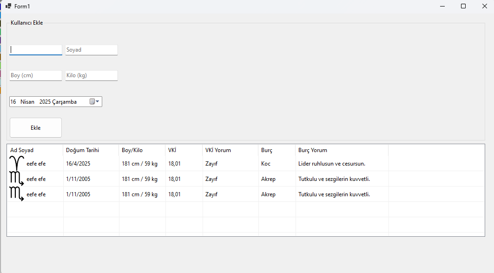

# Görsel Programlama Ödevi

## Ödev Açıklaması
Veritabanı kullanarak aşağıda verilen bilgilere göre çıktıları üreten programı C# form uygulaması olarak yapınız.

   Doğum tarihi: 13.07.2005
   Adı: Hazar
   Soyadı: Demir
   Boy: 1.90
   Kilo: 80

   ---------------------
Veritabanına kaydedilecek alanlar
    Adı: Hazar
    Soyadı: Demir
    Gün:  13
    Ay: Temmuz
    Yıl: 2025

    Burç: Yengeç
    Yorum: ------------
    Burç Resmi: 
    VKİ: 26
    VKİ Yorum: ----------

## Ödev Ayrıntıları

**Kullanılan Teknolojiler:**

- .NET
- Winforms
- SQLite
- Entity Framework ()

**Ekran Görüntüsü:**

**Projenin Derlenmesi:**

- Visual Studio veya VS Code gibi bir kod editörü açılarak proje statik veya dinamik derlenebilir.
- NuGet ile EF için Microsoft.EntityFrameworkCore, Microsoft.EntityFrameworkCore.Sqlite, Microsoft.EntityFrameworkCore.Tools paketleri eklenmeli.
- Entity Framework people.db veritabanını bulamadığında kendisi otomatik db olutşurduğu için önceden herhangi bir veritabanı oluşturmaya gerek yok, EF kendisi oluşturuyor.